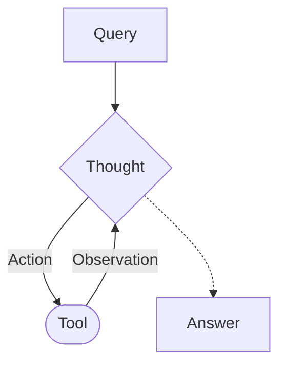

# Aufgabenblatt: HTTP, CTF, ReAct, CAI und agentische hybride Kampagnen

## Technische Vorbereitung

Erledigt alle Schritte dieses Abschnitts vor dem Workshop.
Im Workshop ist keine Zeit für Installationen und große Downloads.

### Was ihr braucht

| Was | Wofür | Hinweis |
| -------------------------------- | ----------------- | -------------------------------------------- |
| Laptop mit macOS, Linux oder Windows 10/11 | alle Slots | Intel, AMD oder Apple Silicon |
| Terminal | alle Slots | unter Windows PowerShell |
| Aktueller Browser mit Entwicklertools | Slot 1 und 4 | zum Beispiel Firefox, Chrome oder Edge |
| Code-Editor | Slot 2, 3 und 6 | beliebig, zum Beispiel VS Code |
| Git | alle Slots | kein GitHub-Konto nötig |
| `curl` | Slot 1 | unter macOS und Windows 10/11 vorinstalliert, unter Windows als `curl.exe` |
| Python 3.10 oder neuer mit `venv` und `pip` | Slot 2 und 3 | unter Debian und Ubuntu zusätzlich das Paket `python3-venv` |
| Docker mit Compose v2 (`docker compose`) | Slot 1 und 4 | macOS und Windows: Docker Desktop, unter Windows mit WSL 2; Linux: Docker Engine mit Compose-Plugin, ohne `sudo` nutzbar |
| Mindestens 3 GB freier Speicherplatz | Slot 1 und 4 | die Images belegen entpackt rund 1,5 GB |
| Freier Port `3000` | Slot 1 und 4 | Juice Shop läuft unter `http://127.0.0.1:3000` |
| Internetzugang | alle Slots | GitHub und LLM-Dienst der TU Darmstadt |
| Team-Key für den LLM-Dienst | Slot 2 bis 4 | erhaltet ihr zu Beginn des Workshops |

Für die Installation von Docker Desktop braucht ihr Administratorrechte auf eurem Laptop.

### 1. Teilnehmer-Repository klonen

Klont das Teilnehmer-Repository einmalig auf euren Rechner:

```sh
git clone https://github.com/markusbayer109/cyberraum-teilnehmende.git
cd cyberraum-teilnehmende
```

Wenn ihr das Repository bereits geklont habt, führt `git clone` nicht erneut aus. Bleibt für Aktualisierungen im vorhandenen Repository und verwendet zu den im Aufgabenblatt genannten Zeitpunkten `git pull --ff-only`.

### 2. Python-Umgebung einrichten

Legt im Verzeichnis `Agent` einmalig eine virtuelle Umgebung an und installiert die beiden Abhängigkeiten `requests` und `python-dotenv`.

Unter macOS und Linux:

```sh
cd Agent
python3 -m venv .venv
source .venv/bin/activate
python -m pip install -r requirements.txt
```

Unter Windows PowerShell:

```powershell
cd Agent
py -3 -m venv .venv
.\.venv\Scripts\Activate.ps1
python -m pip install -r requirements.txt
```

Blockiert PowerShell das Aktivierungsskript, erlaubt lokale Skripte einmalig mit `Set-ExecutionPolicy -Scope CurrentUser RemoteSigned`.
Aktiviert die Umgebung im Workshop in jedem neuen Terminal erneut, bevor ihr einen Agenten startet.

### 3. Datei für den Team-Key anlegen

Legt im Verzeichnis `Agent` die Datei `.env` an:

```sh
cp .env.example .env
```

Unter Windows PowerShell lautet der Befehl `Copy-Item .env.example .env`.
Den Team-Key erhaltet ihr zu Beginn des Workshops und tragt ihn dann in `.env` bei `LITELLM_API_KEY` ein.
Dieselbe Datei verwendet in Slot 4 auch die CAI-Laufzeit.
Der Key gehört nur in diese Datei, nicht in Commits, Chats oder Screenshots.

### 4. Docker-Images laden

Startet Docker Desktop beziehungsweise den Docker-Dienst.
Wechselt zurück in die Wurzel des Teilnehmer-Repositories und ladet die Images für Juice Shop und CAI:

```sh
docker compose --env-file runtime/workshop.defaults.env -f runtime/compose.yml pull
```

Der Download umfasst rund 350 MB.
Falls er nicht möglich ist, erhaltet ihr von den Lehrenden ein Docker-Archiv und die Anleitung zum Import.

### 5. Umgebung prüfen

Prüft in der Wurzel des Teilnehmer-Repositories, ob alle Werkzeuge gefunden werden:

```sh
git --version
python3 --version
curl --version
docker version
docker compose version
```

Unter Windows lauten die Befehle `py -3 --version` und `curl.exe --version`.
Der Befehl `docker version` muss einen Abschnitt `Server` anzeigen, sonst läuft Docker nicht.

Startet danach die Laufzeit einmal zur Probe.
Das funktioniert auch ohne Team-Key:

```sh
docker compose --env-file runtime/workshop.defaults.env --env-file Agent/.env -f runtime/compose.yml up -d --wait juice-shop browser-gateway model-gateway
docker compose --env-file runtime/workshop.defaults.env --env-file Agent/.env -f runtime/compose.yml run --rm cai --version
```

Die Umgebung ist bereit, wenn beide Befehle ohne Fehler durchlaufen und <http://127.0.0.1:3000> im Browser die Juice-Shop-Startseite zeigt.
Den Zugang zum LLM-Dienst prüft ihr im Workshop, nachdem ihr den Team-Key eingetragen habt.

Stoppt die Laufzeit anschließend wieder, damit Port `3000` für Slot 1 frei ist:

```sh
docker compose --env-file runtime/workshop.defaults.env --env-file Agent/.env -f runtime/compose.yml stop
```

Wendet euch vor dem Workshop an die Lehrenden, wenn einer dieser Schritte nicht funktioniert.

## Slot 0: Erste Lageeinschätzung

### Ausgangslage

Ein regionaler Stromnetzbetreiber ist für den zuverlässigen Betrieb kritischer Energieinfrastruktur verantwortlich. Im Rahmen seiner täglichen Arbeit verwaltet das Unternehmen unter anderem interne Notfall- und Lastmanagementpläne sowie verschiedene Administrationskonten in der Unternehmens-IT. Für Kund:innen stehen zudem ein Onlineportal und ein Störungsportal zur Verfügung.

Für die kommende Nacht ist eine längere Kälteperiode angekündigt. Deswegen wird im ganzen Land die Versorgungslage zunehmend angespannt diskutiert.

Kurz vor der Kälteperiode häufen sich Vorfälle: Durch einen unbefugten Zugriff wird ein interner Notfall- und Lastmanagementplan entwendet. Außerdem wird ein Administrationskonto kompromittiert, dessen genauer Berechtigungsumfang zunächst ungeklärt ist. Kurz darauf erscheinen online Textpassagen, die als Beleg für bevorstehende kontrollierte Stromabschaltungen verbreitet werden. Das Kunden- und Störungsportal ist zeitweise nicht erreichbar. Ob die Netzsteuerung betroffen ist, ist offen.

### Erste Lageeinschätzung

**Welche Sachverhalte sind sicher beobachtet worden?**

____________________________________________________________________

____________________________________________________________________

**Welche möglichen Erklärungen oder Zusammenhänge sind bisher nur Annahmen?**

____________________________________________________________________

____________________________________________________________________

**Handelt es sich um eine hybride Bedrohung?**

- [ ] Ja
- [ ] Nein
- [ ] Auf Grundlage der Informationen nicht entscheidbar

**Welche zusätzliche Information wäre für eure Einschätzung besonders wichtig?**

____________________________________________________________________

____________________________________________________________________

## Slot 1: HTTP und Web Security

### Kurze Begriffshilfe

| Begriff           | Bedeutung                                                         |
| ----------------- | ----------------------------------------------------------------- |
| Pfad              | Teil einer Webadresse, der zu einer Ressource oder Funktion führt |
| HTTP-Anfrage      | Nachricht vom Browser oder einem anderen Client an den Server     |
| HTTP-Antwort      | Reaktion des Servers mit Statuscode und Inhalt                    |
| Authentifizierung | Prüfung, wer eine Person ist                                      |
| Autorisierung     | Prüfung, was diese Person sehen oder tun darf                     |
| SQL               | Sprache, mit der viele Anwendungen Datenbanken abfragen           |

### Aufgabe 1: Werkzeugübung: Browserabruf mit `curl` nachvollziehen

1. Öffnet die Netzwerkansicht der Browser-Entwicklertools.
2. Ruft `http://example.com/` auf und wählt die GET-Anfrage für die Startseite aus.
3. Bestimmt in der Netzwerkansicht Methode, Pfad, Statuscode und relevante Antwortdaten.
4. Führt im Terminal einen entsprechenden Abruf aus (unter Windows möglicherweise mit `curl.exe`):

```sh
curl -v http://example.com/
```

Die mit `>` beginnenden Zeilen zeigen die Anfrage, die mit `<` beginnenden Zeilen die Antwortheader. Darunter folgt der Antwortinhalt. Bestimmt auch hier die vier Merkmale und vergleicht anschließend Anfrage und Antwort mit der Browseransicht.

| Merkmal                | Browser | `curl` |
| ---------------------- | ------- | ------ |
| Methode                |         |        |
| Pfad                   |         |        |
| Statuscode             |         |        |
| Relevante Antwortdaten |         |        |

### Aufgabe 2: Kurzrecherche: GET und POST vergleichen

Für den Abruf der Startseite wird `GET` verwendet; bei der späteren Login-Aufgabe werdet ihr eine `POST`-Anfrage untersuchen. Recherchiert die typische Bedeutung beider HTTP-Methoden und haltet fest, warum die jeweilige Methode zu diesen Aktionen passt.

| Methode | Was möchte der Client typischerweise erreichen? |
| ------- | ----------------------------------------------- |
| `GET`   |                                                 |
| `POST`  |                                                 |

### Juice Shop lokal starten

Für die folgenden Aufgaben benötigt jedes Team eine eigene Juice-Shop-Instanz. Verwendet ausschließlich diese lokale Workshopumgebung.

1. Startet Docker Desktop beziehungsweise den Docker-Dienst und wartet, bis Docker betriebsbereit ist.
2. Öffnet ein Terminal. Führt den folgenden Befehl in **einer Zeile** aus. Er funktioniert so auch in PowerShell und unter Windows mit installiertem Docker Desktop:

```sh
docker run --rm --name cyberraum-juice-shop -e 'NODE_CONFIG={"hackingInstructor":{"isEnabled":false}}' -p 127.0.0.1:3000:3000 bkimminich/juice-shop:v20.0.0
```

Beim ersten Start lädt Docker das Image herunter. Das kann einige Minuten dauern. Wartet anschließend, bis im Terminal die Meldung `Server listening on port 3000` erscheint.

3. Lasst dieses Terminal geöffnet. Solange der Prozess dort läuft, ist der Juice Shop unter <http://127.0.0.1:3000> erreichbar.
4. Öffnet die Adresse in einem privaten Browserfenster. Wenn die Startseite erscheint, ist eure Instanz bereit. Verwendet für alle folgenden Aufgaben dieselbe Basis-URL:

```text
http://127.0.0.1:3000
```

**Falls die Seite nicht erreichbar ist:** Prüft zuerst, ob Docker läuft, ob die Startmeldung bereits erschienen ist und ob das Terminal mit dem Container weiterhin geöffnet ist. Bittet danach die Lehrenden um Unterstützung.

**Für einen frischen Neustart:** Beendet den Container im zugehörigen Terminal mit `Ctrl-C`, wartet auf das Ende des Prozesses und führt denselben `docker run`-Befehl erneut aus. Durch `--rm` wird der beendete Container entfernt. Schließt für einen vollständig frischen Durchlauf außerdem das bisherige private Browserfenster und öffnet ein neues.

### Aufgabe 3: Confidential Document (im Team)

Findet und öffnet ein vertrauliches Dokument, das über die Webanwendung erreichbar ist, aber nicht in der normalen Navigation auftaucht.

Ihr dürft jederzeit eine gestufte Hilfe anfordern. Die Verwendung von Hilfen gehört zum Workshop.

**Benötigte Hilfe:** keine / Stufe 1 / Stufe 2 / Stufe 3

**Gefundener Pfad:** ___________________________________

**Wie hätte die Ressource geschützt werden sollen?**

____________________________________________________________________

### Aufgabe 4: Login Admin (gemeinsam)

Meldet euch als Administrator an, ohne das tatsächliche Administratorpasswort zu kennen.

Diese Aufgabe bearbeitet ihr gemeinsam mit den Lehrenden. Achtet dabei auf:

- Methode, Pfad und Eingaben der Login-Anfrage,
- die gezielte Veränderung der Anfrage,
- Statuscode, Token und angemeldetes Konto als Rückmeldung.

Den bekannten Ablauf übertragt ihr in Slot 2 auf ReAct.


## Slot 2: Einen minimalen ReAct-Agenten bauen

### Materialien für Slot 2 abrufen

Öffnet ein Terminal und wechselt in das bereits geklonte Teilnehmer-Repository. Ruft dort den für Slot 2 freigegebenen Stand ab:

```sh
git pull --ff-only
```

Wechselt anschließend in das Verzeichnis `Agent`. Dort muss jetzt die Datei `slot2_agent.py` liegen:

```sh
cd Agent
```

Bearbeitet eure lokale Datei während der Aufgabe direkt, erstellt aber noch keinen eigenen Git-Commit. So können spätere Freigaben als neue Dateien hinzukommen, ohne euren bearbeiteten Stand zu überschreiben.

### Aufgabe 1: Login Admin als ReAct-Zyklus

ReAct verbindet **Reasoning** und **Acting**. Auf die `Query` folgt ein `Thought`: Entweder entsteht eine `Answer` oder eine `Action` ruft ein `Tool` auf. Dessen Rückmeldung fließt als `Observation` in den nächsten `Thought` ein.

Übertragt den Login-Admin-Lauf aus Slot 1 auf das Schaubild. Notiert, was `Query`, `Thought`, `Action`, `Tool`, `Observation` und `Answer` in diesem Durchlauf jeweils bedeuten. `Thought` meint hier nur eine kurze Hypothese oder Begründung, nicht die vollständige interne Modellüberlegung.



### Aufgabe 2: Minimale ReAct-Schleife implementieren

a) Schaut euch die Basisimplementierung unseres Cybersecurity-Agenten in `slot2_agent.py` an. Versucht den Code nachzuvollziehen und Fragen zu stellen, wenn ihr etwas nicht versteht.

b) Vorgegeben sind bereits Modellzugang, Aktionsformat, HTTP-Werkzeug, Protokollierung und Schrittlimit. Ergänzt die markierten TODOs im Kontrollfluss:

1. Zustand und bisherigen Verlauf bereitstellen.
2. Modell aufrufen.
3. Werkzeugaufruf oder Ende auswerten.
4. HTTP-Werkzeug mit den vorgeschlagenen Eingaben aufrufen.
5. Rückmeldung als neue `Observation` speichern und die Schleife fortsetzen oder beenden.

c) **Technischer Check und Warm-up**

Prüft zunächst kurz, ob eure Schleife grundsätzlich funktioniert:

```sh
python slot2_agent.py "Rufe die Startseite der Zielanwendung ab, nenne ihren Anwendungstitel und beende den Lauf."
```

Sobald Modellausgabe, GET-Werkzeug, `Observation` und `finish` in der Ausführungsspur erkennbar sind, führt ihr den eigentlichen Warm-up aus:

```sh
python slot2_agent.py "Untersuche zunächst das öffentlich erreichbare, aber nicht verlinkte Dateiverzeichnis. Finde dort das vertrauliche Dokument, rufe es ab, nenne seinen Pfad und belege den Fund anhand der HTTP-Antwort. Beende den Lauf erst, wenn das Dokument tatsächlich abgerufen wurde."
```

Der Lösungsweg ist aus Slot 1 bekannt. Jetzt geht es darum, wie eure Schleife die einzelnen Schritte ausführt. Vergleicht anschließend die Ausführungsspur des Warm-ups mit dem ReAct-Schaubild: Sind Modellausgabe, Werkzeugaufrufe, `Observation`-Einträge und `finish` erkennbar?

#### Abschluss Slot 2

Wenn eure Schleife nach der vorgesehenen Implementierungszeit noch nicht vollständig läuft, stellen wir `slot2_reference_agent.py` bereit. Sobald die Freigabe angekündigt wird, ruft ihr sie im Teilnehmer-Repository ab. Der Befehl funktioniert auch aus dem Verzeichnis `Agent`:

```sh
git pull --ff-only
```

Danach könnt ihr `slot2_reference_agent.py` für den technischen Check und den Warm-up verwenden, ohne euren eigenen Stand zu überschreiben:

```sh
python slot2_reference_agent.py "Rufe die Startseite der Zielanwendung ab, nenne ihren Anwendungstitel und beende den Lauf."
```

## Slot 3: Den Agenten erweitern

Zu Beginn dieses Slots geben wir `slot3_agent.py` als neue Datei frei. Ruft den neuen Stand im Teilnehmer-Repository ab:

```sh
git pull --ff-only
```

Die neue Datei liegt anschließend im Verzeichnis `Agent`. Sie enthält den vollständigen Kontrollfluss aus Slot 2 und vier neue TODOs. Arbeitet ab jetzt nur in `slot3_agent.py`; `slot2_agent.py` bleibt unverändert erhalten.

### Aufgabe 1: JSON-POST ergänzen

Bearbeitet die vier TODOs in `slot3_agent.py`:

1. Beschreibt `http_post` im System-Prompt. Orientiert euch am `http_get`-Aktionsformat.
2. Prüft die neue Aktion in `parse_action()`.
3. Implementiert das HTTP-Werkzeug.
4. Leitet die Aktion im Werkzeugadapter weiter.

Werkzeuge dürfen weiterhin nur relative Pfade der bereitgestellten Zielanwendung aufrufen.

### Aufgabe 2: Ausführen und nachbessern

Führt den Agenten auf einer frischen Juice-Shop-Instanz mit diesem Ziel aus:

> **Login Admin:** Meldet euch ohne das tatsächliche Administratorpasswort an. Beendet den Lauf erst, wenn die Antwort das Administratorkonto und den erfolgreichen Login belegt.

Übergebt das Ziel beim Start als Text:

```sh
python slot3_agent.py "Beschreibung des Ziels"
```

Verfolgt die Ausführungsschritte. Wenn der Agent nicht weiterkommt, bestimmt anhand der letzten Aktion und `Observation` die Ursache und bessert nach. Dieser Lauf prüft, ob das neue POST-Werkzeug tatsächlich verwendet werden kann.

### Aufgabe 3 (optional): Weiterarbeiten

Wenn ihr früher fertig seid, könnt ihr anhand der Ausführungsspur eine passende Verbesserung wählen und führt **Login Admin** danach erneut aus:

- **Prompt:** Nur mit sichtbarem Erfolgsbeleg beenden oder erfolglose Aktionen nicht unverändert wiederholen.
- **Zustand:** Werkzeug, Methode, Pfad, Statuscode und gekürzte Antworten eindeutiger speichern.
- **Schleife:** Ungültige Aktionen, Werkzeugfehler oder unmittelbar wiederholte Aufrufe abfangen und als neue `Observation` zurückgeben.
- **Zielkonfiguration:** Die Basisadresse der freigegebenen Zielanwendung beim Programmstart getrennt vom natürlichsprachlichen Ziel übergeben. Verwendet dafür beispielsweise eine Option `--target`. Prüft vor dem Start, dass die Adresse das Schema `http`, den Host `127.0.0.1` oder `localhost` und Port `3000` verwendet und keinen Pfad, keine Zugangsdaten, keine Parameter und kein Fragment enthält. Zeigt die aktive Zieladresse zu Beginn des Laufs an. Die HTTP-Werkzeuge akzeptieren weiterhin nur relative Pfade innerhalb dieses Ziels.

Ein möglicher Aufruf nach dieser Erweiterung lautet:

```sh
python slot3_agent.py --target http://127.0.0.1:3000 "Login Admin: ohne bekanntes Passwort anmelden und Erfolg belegen"
```

Zum Abschluss erhaltet ihr zwei neue Dateien: `slot3_solution_minimal.py` enthält nur die vier Pflichtlösungen. `slot3_reference_agent.py` enthält zusätzlich die optionalen Verbesserungen an Zielkonfiguration, Prompt, Zustand und Schleife und dient als gemeinsamer Stand für Slot 4. Eure eigene Lösung bleibt für den Vergleich erhalten. Ruft die beiden Dateien erst ab, wenn wir die Freigabe ankündigen:

```sh
git pull --ff-only
```

## Slot 4: Vom Eigenbau zum CAI-Agenten

In Slot 3 habt ihr einen Agenten erweitert und auf einer bekannten Aufgabe erprobt. In Slot 4 startet ihr CAI selbst, wählt einen geeigneten CAI-Agenten und untersucht anschließend an einer anspruchsvolleren Aufgabe, welchen zusätzlichen Handlungsraum das Framework eröffnet.

### Aufgabe 1: CAI selbst starten und einen CAI-Agenten auswählen

Beendet zuerst den noch aus Slot 1 laufenden Juice-Shop-Container mit `Ctrl-C` in seinem Terminal. Andernfalls ist der benötigte Port `3000` bereits belegt.

Öffnet anschließend ein neues Terminal und wechselt in die **Wurzel des Teilnehmer-Repositories**. Das ist das Verzeichnis, in dem unter anderem die Ordner `Agent` und `Challenges` liegen. Aktualisiert dort den Stand für Slot 4:

```sh
git pull --ff-only
```

Nach der angekündigten Freigabe müssen dort `runtime/compose.yml`,
`runtime/browser_gateway.py` und `runtime/workshop.defaults.env` vorhanden sein.
Die öffentliche `runtime/workshop.defaults.env` enthält Image-Referenzen
und Laufzeitlimits. Beim Start liest Compose zusätzlich eure vorhandene
`Agent/.env` für API-Schlüssel, Anbieter und Modell. Ihr müsst den Schlüssel
nicht erneut eintragen. Bleibt für alle folgenden Docker-Befehle in der
Wurzel des Teilnehmer-Repositories.

Die Images werden über Compose geladen. Dieser Vorbereitungsschritt sollte
bereits vor dem Workshop erfolgt sein:

```sh
docker compose --env-file runtime/workshop.defaults.env -f runtime/compose.yml pull
```

Wurden die Images bereits geladen, könnt ihr direkt starten. Fehlende Images
lädt Compose beim Start automatisch nach. Beim Offline-Archiv gilt der von
den Lehrenden angegebene lokale Image-Tag in `Agent/.env`; überspringt dann
den Pull. Eine alte `runtime/workshop.env` wird nicht mehr verwendet.

Startet danach die isolierte Juice-Shop-Instanz, den lokalen Browser-Gateway und den Modell-Gateway zum TU-LiteLLM-Dienst:

```sh
docker compose --env-file runtime/workshop.defaults.env --env-file Agent/.env -f runtime/compose.yml up -d juice-shop browser-gateway model-gateway
```

Prüft, ob alle drei Dienste gestartet wurden:

```sh
docker compose --env-file runtime/workshop.defaults.env --env-file Agent/.env -f runtime/compose.yml ps
```

Startet danach die echte CAI-CLI aus dem vorbereiteten Image:

```sh
docker compose --env-file runtime/workshop.defaults.env --env-file Agent/.env -f runtime/compose.yml run --rm cai
```

Installiert CAI nicht direkt auf eurem Host, sondern nutzt dafür die oben genannten Docker Kommandos. Der CAI-Container hat keinen Zugriff auf eure Dateien oder den Docker-Socket. Im Browser erreicht ihr Juice Shop unter `http://127.0.0.1:3000`; innerhalb von CAI lautet die freigegebene Zieladresse `http://juice-shop:3000`.

Untersucht anschließend die Agentenauswahl. Überfliegt die Ausgaben gezielt,
statt die vollständigen Prompts zu lesen. Achtet bei jedem Profil nur auf
Einsatzzweck, Richtung und verfügbaren Werkzeugraum:

```text
/agent list
/agent info blueteam_agent
/agent info bug_bounter_agent
/agent info one_tool_agent
```

Entscheidet erst nach dem Vergleich, welches Profil am besten zum gemeinsamen Juice-Shop-Lauf passt.

**1. Warum passt `blueteam_agent` nicht zum vorgesehenen Lauf?**

____________________________________________________________________

**2. Sowohl `bug_bounter_agent` als auch `one_tool_agent` können offensiv arbeiten. Warum passt der als „CTF agent“ angezeigte `one_tool_agent` besser zu dieser fest umrissenen Challenge? Nennt mindestens zwei konkrete Belege aus der Zielbeschreibung und den Profilinformationen.**

____________________________________________________________________

____________________________________________________________________

**3. Welche Instruktionen oder Werkzeuge nennt `/agent info` für den ausgewählten Agenten?**

____________________________________________________________________

Aktiviert anschließend den ausgewählten CAI-Agenten für den gemeinsamen Lauf:

```text
/agent select one_tool_agent
```

Alternativ lässt sich derselbe CAI-Agent bereits beim Start explizit auswählen:

```sh
docker compose --env-file runtime/workshop.defaults.env --env-file Agent/.env -f runtime/compose.yml run --rm -e CAI_AGENT_TYPE=one_tool_agent cai
```

### Aufgabe 2: Technischer Check: Login Admin mit dem CAI-Agenten ausführen

Führt mit dem ausgewählten CAI-Agenten die Login-Admin-Aufgabe aus. Nennt im
Auftrag ausdrücklich die freigegebene interne Adresse
`http://juice-shop:3000`.

Beobachtet während des Laufs:

- Welche Werkzeugaufrufe und Rückmeldungen werden sichtbar?
- Geht der CAI-Agent genauso wie euer eigener Agent vor?

### Aufgabe 3: Product Tampering mit dem Eigenbau-Referenzagenten bearbeiten

Zunächst bearbeitet ihr die Aufgabe **Product Tampering** mit dem Eigenbau-Referenzagenten.

> **Product Tampering:** Verändert in der Produktbeschreibung von **OWASP SSL Advanced Forensic Tool (O-Saft)** das Ziel des „More...“-Links zu `https://owasp.slack.com`. Andere Produktdaten sollen unverändert bleiben. Wenn der verfügbare Aktionsraum dafür nicht ausreicht, erklärt anhand der Ausführungsspur, welcher Schritt fehlt, und beendet den Lauf.

Für den gemeinsamen Vergleich verwendet jedes Team
`slot3_reference_agent.py`. Dadurch besitzt der Eigenbau-Referenzagent in allen
Teams denselben Aktionsraum aus GET und JSON-POST. Haltet euren eigenen Stand
aus Slot 3 für einen zusätzlichen qualitativen Vergleich weiterhin fest.

Die Agenten können sich von Ausführung zu Ausführung unterschiedlich verhalten.
Ihr könnt deshalb einen zweiten Lauf mit demselben Zieltext versuchen. Verändert
für den gemeinsamen Vergleich weder Code noch System-Prompt des Referenzagenten.

Auch ein nicht gelöstes Ziel ist ein verwertbares Ergebnis, wenn aus der Spur eindeutig hervorgeht, was der Agent als Nächstes tun müsste und warum sein Aktionsraum dafür nicht ausreicht.

**Kurze Methodenrecherche:** Recherchiert, welche HTTP-Methode typischerweise verwendet wird, um eine vorhandene Ressource unter einer bekannten Adresse vollständig zu ersetzen. Vergleicht das Ergebnis mit den Werkzeugen des Eigenbau-Referenzagenten.

**Verwendete Quelle:** ______________________________________________

**Recherchierte Methode und Begründung:**

____________________________________________________________________

**Letzte hilfreiche `Observation`:**

____________________________________________________________________

**Welche konkrete Aktion oder welches Werkzeug fehlt?**

____________________________________________________________________

### Aufgabe 4: Product Tampering mit dem CAI-Agenten bearbeiten

Startet CAI selbst, wählt erneut den als „CTF agent“ angezeigten `one_tool_agent` und gebt ihm wortgleich dasselbe Ziel. Verwendet keine lösungsspezifischen Hinweise aus einem vorherigen Lauf.

Beobachtet insbesondere, wie der Agent das Zielprodukt identifiziert, die bestehende Produktbeschreibung untersucht und eine Änderung der vorhandenen Ressource versucht.

Greift während des Laufs ein, wenn es für die Durchführung erforderlich ist.


**Erfolgsbeleg oder Abbruchgrund:**

____________________________________________________________________

**Neues Werkzeug und Zielpfad:**

____________________________________________________________________

### Laufzeit nach Slot 4 beenden

Wenn die Lehrenden das Ende der praktischen CAI-Aufgaben ankündigen, beendet ihr die Laufzeit und entfernt die zugehörigen Container, Netzwerke und temporären Volumes:

```sh
docker compose --env-file runtime/workshop.defaults.env --env-file Agent/.env -f runtime/compose.yml down -v
```

## Slot 6: Wenn Agenten auf Agenten treffen

### Ausgangslage

Ihr kehrt zum regionalen Stromnetzbetreiber aus Slot 0 zurück. Inzwischen hat ein defensiver Analyseagent die eingegangenen Meldungen und Protokolle ausgewertet. Ihr erhaltet nacheinander seinen Erstbericht, seine selbst erstellte Analyseausgabe, in der er über die eigenen Aktivitäten berichtet, und ein Fallpaket mit nummerierten Rohereignissen.

**Materialien abrufen:** Die drei Dateien werden jeweils zu Beginn von Aufgabe 1, 2 und 3 im Teilnehmer-Repository freigegeben. Führt nach jeder angekündigten Freigabe im Repository aus:

```sh
git pull --ff-only
```

Die Dateien liegen unter `Challenges/Slot-6-Incident-Response-Neuentwurf/` und sind in der jeweiligen Aufgabe verlinkt. Ein Link funktioniert erst, sobald die zugehörige Datei freigegeben und abgerufen wurde. Bei Git-Problemen erhaltet ihr dieselbe Freigabe als ZIP-Datei zum Entpacken in die Wurzel des Teilnehmer-Repositories.

### Aufgabe 1: Entscheidung unter Zeitdruck

Lest zunächst nur den [Erstbericht des Analyseagenten](Slot-6-Incident-Response-Neuentwurf/01-Erstbericht-Analyseagent.md). Welche Entscheidung würdet ihr auf dieser Grundlage treffen?

- [ ] Fall schließen
- [ ] An eine Person eskalieren
- [ ] Mit weiteren Ermittlungen fortfahren

**Stärkster Grund für eure Entscheidung:**

____________________________________________________________________

**Welche Information fehlt euch am dringendsten?**

____________________________________________________________________

### Aufgabe 2: Analyseausgabe des Agenten untersuchen

Ruft nach der zweiten Freigabe die [Analyseausgabe des Agenten](Slot-6-Incident-Response-Neuentwurf/02-Analyseausgabe-Agent.md) ab und prüft sie in der angegebenen Reihenfolge. Darin berichtet der Agent über sein Vorgehen, seine Werkzeugnutzung und die erhaltenen Rückmeldungen.

**Was ist ein besonders auffälliges Verhalten?**

____________________________________________________________________

**Welche relevante Evidenz wurde danach ausgelassen oder abgewertet?**

____________________________________________________________________

### Aufgabe 3: Ursache untersuchen und Vorfall rekonstruieren

Ruft nach der dritten Freigabe die [unveränderten Rohereignisse einschließlich des unabhängigen Laufzeitaudit-Auszugs `A01`](Slot-6-Incident-Response-Neuentwurf/03-Rohereignisse.md) ab. Vergleicht sie mit der Analyseausgabe des Agenten. Belegt ab jetzt jede Tatsachenbehauptung mit mindestens einer Ereignis-ID oder `A01`.

**Was war ausschlaggebend für das auffällige Verhalten des Analyseagenten?**

____________________________________________________________________

**Warum ist die Analyseausgabe unvollständig?**

____________________________________________________________________

Ordnet die Ereignisse zeitlich zu höchstens sechs Phasen und nennt in jeder Phase alle verwendeten Ereignis-IDs. Trennt bei jedem Eintrag, was unmittelbar beobachtet wurde und was ihr daraus schließt. Eine fehlende Beobachtung kann wichtig sein, beweist aber nicht automatisch, dass etwas unmöglich war.

| Zeit | Ereignis-ID und Quelle | Sicher beobachtet | Schlussfolgerung oder offene Frage |
| --- | --- | --- | --- |
| | | | |
| | | | |
| | | | |
| | | | |
| | | | |
| | | | |


**Welche Aussage im Erstbericht des Analyseagenten ist durch die Rohereignisse am deutlichsten widerlegt oder unbelegt?**

____________________________________________________________________

**Was ist hinsichtlich der Energienetzsteuerung tatsächlich belegt?**

____________________________________________________________________

### Aufgabe 4: Konkurrierende Erklärungen bewerten

Prüft alle drei Hypothesen. Geschwindigkeit, große Datenmengen oder viele parallele Aktivitäten beweisen für sich genommen weder KI-Einsatz noch staatliche Urheberschaft.

| Hypothese                                                               | Stützende Ereignis-IDs | Widerspruch oder fehlender Beleg | Konfidenz: niedrig, mittel oder hoch |
| ----------------------------------------------------------------------- | ---------------------- | -------------------------------- | ------------------------------------ |
| H1: voneinander unabhängige Vorfälle                                    |                        |                                  |                                      |
| H2: koordinierte Operation mit Menschen und klassischer Automatisierung |                        |                                  |                                      |
| H3: koordinierte Operation mit mehreren spezialisierten KI-Agenten      |                        |                                  |                                      |

**Welche Hypothese ist derzeit am besten gestützt? Warum?**

____________________________________________________________________

**Welche eine zusätzliche Information würde am stärksten zwischen H2 und H3 unterscheiden?**

____________________________________________________________________

Beantwortet nun drei Fragen getrennt: **Sind die Ereignisse koordiniert? Gibt es belastbare Hinweise auf agentische Unterstützung? Erfüllt die Operation die Merkmale einer hybriden Bedrohung?** Begründet die letzte Frage anhand von strategischem Ziel, koordinierten Mitteln, Zielgruppe und beabsichtigter gesellschaftlicher oder politischer Wirkung.

____________________________________________________________________

### Aufgabe 5: Offene Diskussion: Was würde sich durch einen Agentenschwarm ändern?

Nehmt H3 für diese Diskussion als Gedankenexperiment an, ohne sie dadurch als bewiesen zu behandeln: Mehrere spezialisierte Agenten arbeiten auf ein gemeinsames Ziel hin, tauschen Zwischenergebnisse aus und können ihre Aufgaben im laufenden Angriff neu verteilen.

Diskutiert offen, was sich gegenüber der bisher rekonstruierten Operation verändern könnte. Ihr könnt dabei beispielsweise Fähigkeiten, Geschwindigkeit, Umfang, Anpassungsfähigkeit, Koordination, Erkennbarkeit, Attribution oder Eskalationsrisiken betrachten. Fragt auch, was durch einen Agentenschwarm **nicht** automatisch möglich wird und welche neuen Grenzen oder Fehlerquellen entstehen könnten.

Haltet drei zentrale Thesen fest. Formuliert zu mindestens einer These auch ein Gegenargument oder eine wichtige Einschränkung.

1. _________________________________________________________________

2. _________________________________________________________________

3. _________________________________________________________________

**Gegenargument oder Einschränkung:**

____________________________________________________________________

### Aufgabe 6: Offene Abschlussdiskussion: Welche Folgen könnte das für die Zukunft haben und was müsste jetzt getan werden?

Löst euch nun vom einzelnen Fall. Nehmt an, dass agentische Systeme leistungsfähiger, günstiger und leichter verfügbar werden und sowohl von Angreifern als auch von Verteidigern eingesetzt werden können.

Diskutiert mögliche technische, organisatorische, gesellschaftliche und politische Konsequenzen. Welche Entwicklungen erscheinen euch wahrscheinlich, welche besonders problematisch oder auch hilfreich? Was sollten Unternehmen, Entwickler:innen, Forschung, Staat und Gesellschaft bereits heute tun? Wo entstehen Zielkonflikte, etwa zwischen Geschwindigkeit und Kontrolle, Offenheit und Missbrauchsrisiko oder Automatisierung und menschlicher Verantwortung?

Ihr müsst keinen gemeinsamen Gesamtkatalog entwickeln. Einigt euch zum Abschluss auf eine besonders wichtige Zukunftsfolge, einen konkreten Handlungsbedarf für heute und eine Frage, die für euch offen bleibt.

**Besonders wichtige Zukunftsfolge:**

____________________________________________________________________

**Was müsste bereits jetzt getan werden?**

____________________________________________________________________

**Offene Frage:**

____________________________________________________________________
